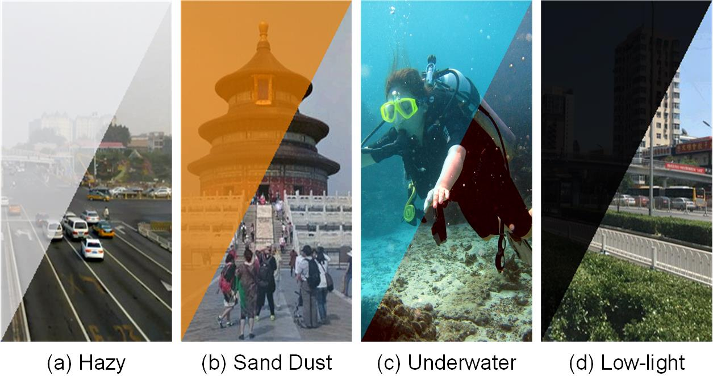
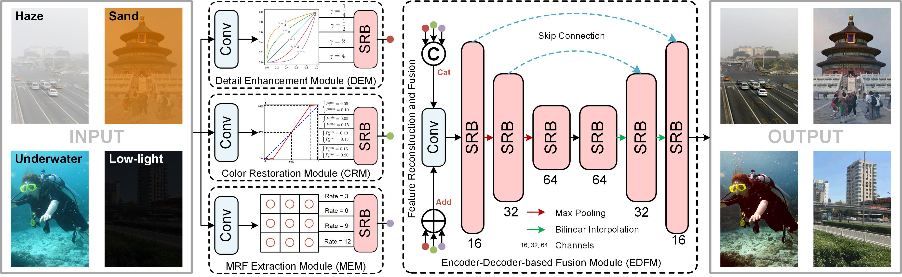

# <p align=center> [KBS] All-in-One Scene Recovery Networks via Multi-knowledge Integration</p>

<div align="center">


</div>

---
>**AoSRNet: All-in-One Scene Recovery Networks via Multi-knowledge Integration**<br> [Yuxu Lu](https://scholar.google.com.hk/citations?user=XXge2_0AAAAJ&hl=zh-CN), [Dong Yang <sup>*</sup>](https://www.yangdong.info/), [Yuan Gao](https://scholar.google.com.hk/citations?user=4JpRnU4AAAAJ&hl=zh-CN), [Yu Guo](https://scholar.google.com/citations?user=klYz-acAAAAJ&hl=zh-CN), [Ryan Wen Liu](http://mipc.whut.edu.cn/index.html), [Jun Liu](https://scholar.google.com.hk/citations?user=hIOsBLkAAAAJ&hl=zh-CN&oi=sra) (* indicates corresponding author) <br> 

> **Abstract:** *Scattering and attenuation of light in no-homogeneous imaging media or inconsistent light intensity will cause insufficient contrast and color distortion in the collected images, which limits the developments such as vision-driven smart urban, autonomous vehicles, and intelligent robots. In this paper, we propose an all-in-one scene recovery network via multi-knowledge integration (AoSRNet) to improve the visibility of imaging devices in typical low-visibility imaging scenes (e.g., haze, sand dust, and low light). It combines gamma correction (GC) and optimized linear stretching (OLS) to create the detail enhancement module (DEM) and color restoration module (CRM). Additionally, we suggest a multi-receptive field extraction module (MEM) to attenuate the loss of image texture details caused by GC nonlinear and OLS linear transformations. Finally, we refine the coarse features generated by DEM, CRM, and MEM through Encoder-Decoder to generate the final restored image. Comprehensive experimental results demonstrate the effectiveness and stability of AoSRNet compared to other state-of-the-art methods. The source code is available at \url{https://github.com/LouisYuxuLu/AoSRNet}.*
<hr />

## Requirement

- Python 3.7
- Pytorch 1.12.0

## Examples of the Scene Recovery in Four Different Imaging Conditions


## Network Architecture


## Test
* Place the pre-training weight in the `checkpoint` folder.
* Place test low-visibility images in the `input` folder.
* Modify the weight name in the `test_demo.py`.<br>
* Run `test_demo.py`
* The results are saved in `output` folder.

## Visual Results on Synthetic Images


## Visual Results on Real-world Images


## Visual Results on Underwater Images
The proposed all-in-one scene recovery network generalizes well to underwater image enhancement without any parameter fine-tuning.


## Citation

```
@article{lu2024aosrnet,
  title={AoSRNet: All-in-One Scene Recovery Networks via multi-knowledge integration},
  author={Lu, Yuxu and Yang, Dong and Gao, Yuan and Liu, Ryan Wen and Liu, Jun and Guo, Yu},
  journal={Knowledge-Based Systems},
  volume={294},
  pages={111786},
  year={2024},
  publisher={Elsevier}
}
